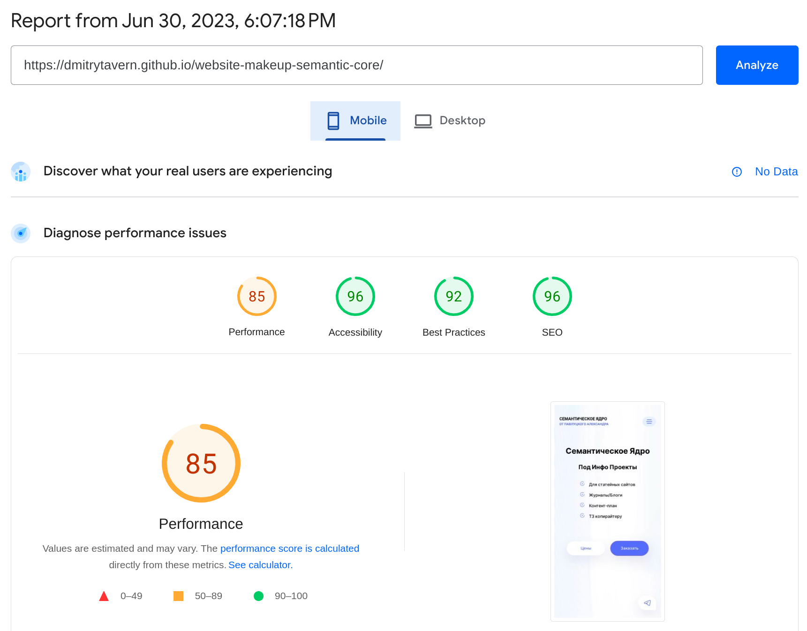
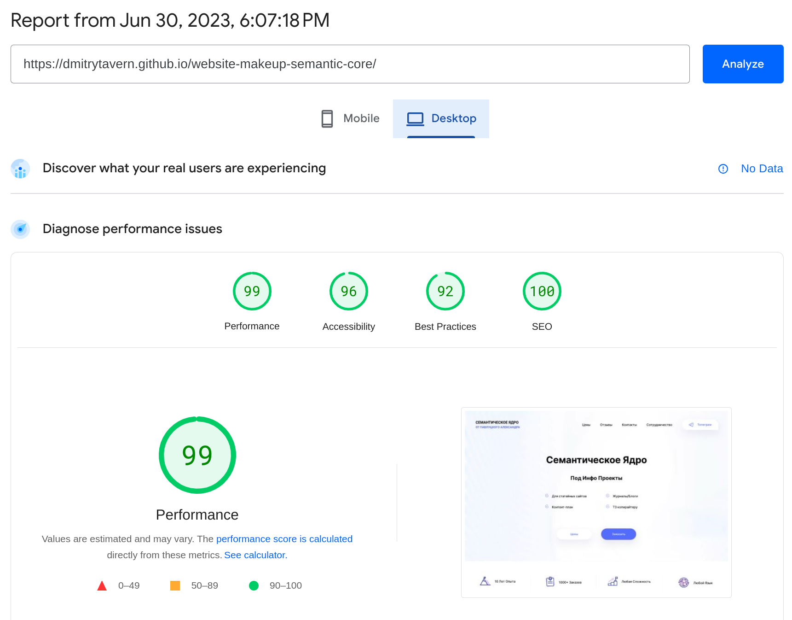

# **Semantic Core**

Makeup landing page of medium complexity, aimed at SEO promotion. See [**demo**](https://dmitrytavern.github.io/website-makeup-semantic-core/).

**Developers:**

- [Dmitry Tavern (developer)](https://github.com/dmitrytavern).
- [Lyovushkin Kyrylo (designer)](https://www.instagram.com/k.lyovushkin/).

**Screenshot:**


## Formulation of the problem

Create a cross-browser, adaptive landing page by design in Sketch. Key points for adaptability: **375px**, **768px**, **1100px**, **1600px**. There are no additional requirements.

Pages to create:

- [Home](https://dmitrytavern.github.io/website-makeup-semantic-core/)

## Technologies

&nbsp;
&nbsp;
&nbsp;
&nbsp;
&nbsp;
&nbsp;
&nbsp;
&nbsp;
&nbsp;
&nbsp;
&nbsp;
&nbsp;
&nbsp;
&nbsp;
&nbsp;
&nbsp;

Also used: **jQuery Fancybox**.

## Performance

On phones the site works well, while on desktops everything is fine. The main reason is that the site itself is quite large and has a lot of html dom elements.

&nbsp;
&nbsp;

## Conclusions

I personally liked this site. It has a nice and stylish design, made in one piece and in the form of one page. It was developed 45 hours, which is generally a lot. But in my opinion, for this site is acceptable. One of the requirements was to make it very quickly, literally 3-4 days, which got done.

In addition, even after a while I find it difficult to identify any critical errors. Perhaps there are common errors in the layout itself, in the names of classes, in the styles or scripts of the site.

The following errors can be distinguished:

- **Many scripts.** I include Swiper.js, jQuery, jQuery Fancybox and Bootstrap.js. That's a lot for a site like this, and you could have done without Bootstrap.js.

## Guide

If you only need a finished build, you can download it from the [latest release](https://github.com/dmitrytavern/website-makeup-semantic-core/releases/latest/download/website-makeup.tar.gz).

This project is obsolete and uses an older version of **Node.js** - **v16.20.1**. There may be errors on newer versions. Make sure you are using this version of Node.js.

There may also be problems running on **Windows** or **MacOs** because the webpack config may not be ready due to different implementation paths.

Steps to manually build a project:

1. Clone a repository:

```
git clone https://github.com/dmitrytavern/website-makeup-semantic-core.git
```

2. Install dependencies:

```
npm ci
```

3. Run a command:

```
npm run dev
npm run build
npm run build:serve
```

- **npm run dev** - launches a live-reload webpack dev server for development.
- **npm run build** - builds the entire project in a production version.
- **npm run build:serve** - runs the production server to test the finished build.

## License

MIT - check repo files

Copyright (c) 2020-present, Dmitry Tavern
